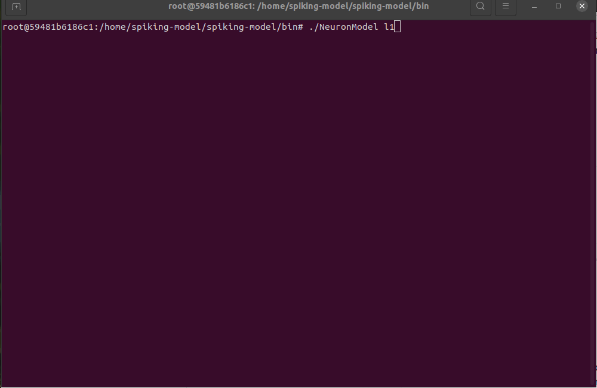
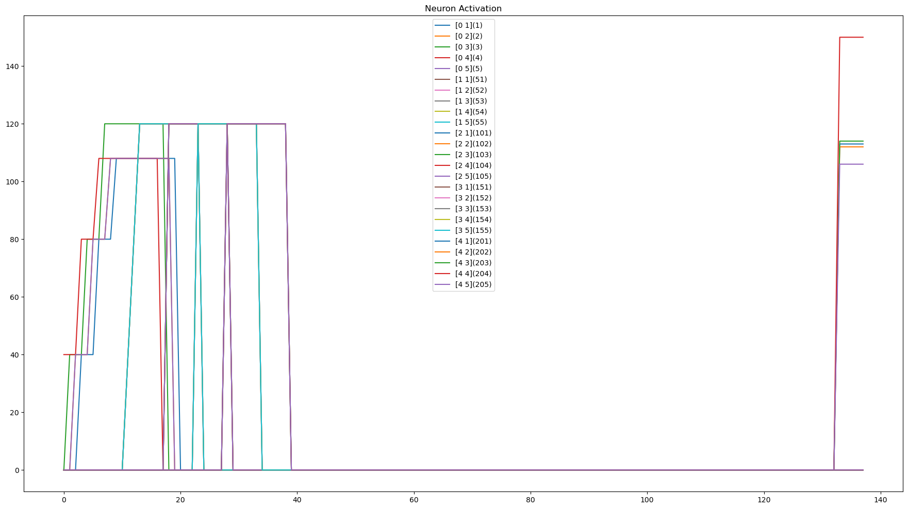
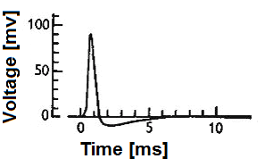
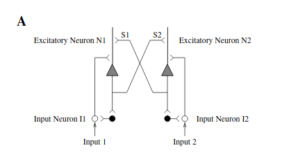
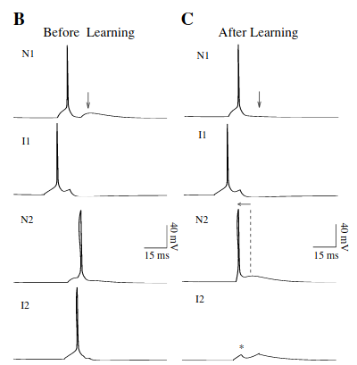
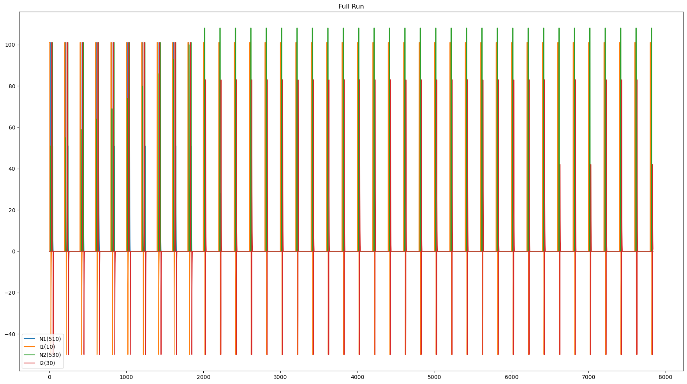
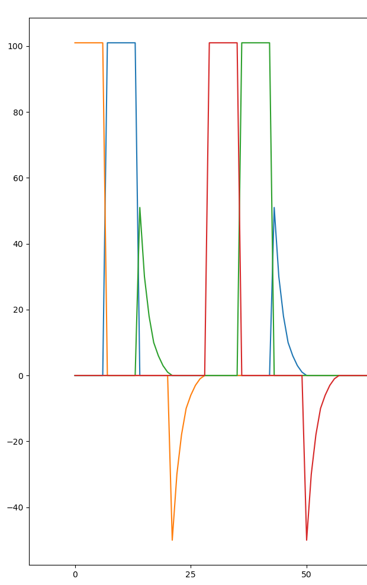
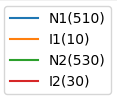
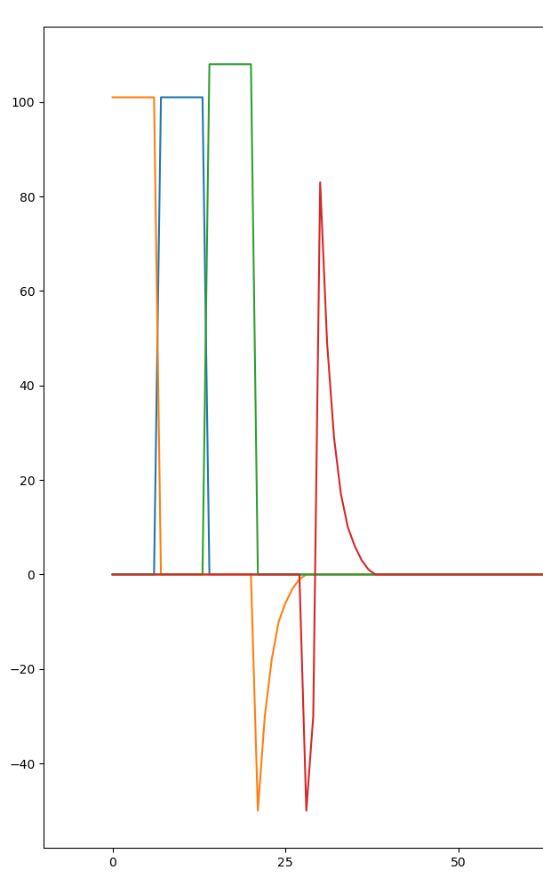
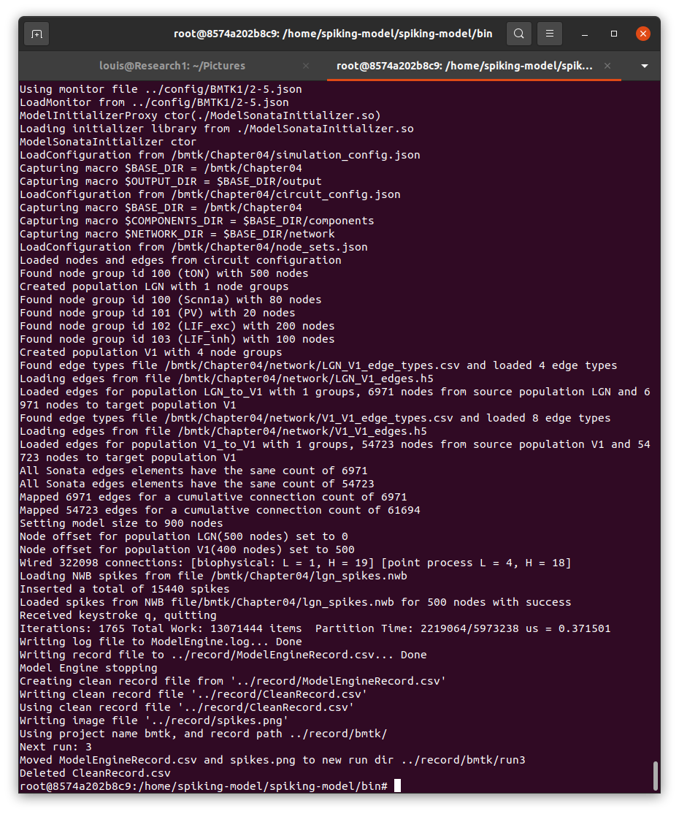

# Spiking Neuron Model
## A C++ Spiking Neural Network based on [LouisRoss/ModelEngine](https://github.com/LouisRoss/modelengine) to efficiently execute with all available cores

This program is designed to run *spiking neural networks* (SNNs) using the [Model Engine](https://github.com/LouisRoss/modelengine)
framework.  SNNs are different from the more common *artificial neural networks* (ANNs) typically used in today's deep learning algorithms.

ANNs capture a static snapshot of the average firing rate of neurons.  Each neuron's state is a single positive value indicating its activity.  Connections between neurons are captured as another single number, a weight, this time a signed value that can swing positive or negative.  The activity of a downstream neuron is a function of summing all the products of the activities of upstream neurons multiplied by their connection weights.

SNNs, are an attempt to be more biologically plausible.  As with ANNs, there are upstream neurons that connect with downstream neurons, and the connections have weights.  The difference is that with SNNs there is no averaging &mdash; each neuron produces a spike or series of spikes.  Downstream neurons integrate the spikes sent by upstream neurons, as mediated by the connection weights, and when enough recent upstream activity accumulates, the downstream neuron will fire its own spike.

Reasons why spiking might be worth trying:
- It is possible that the spike timing and phase of arriving spikes adds information that gets lost during the averaging process used in ANNs.
- Learning in biological systems uses only information that is local to the networks doing the learning.  In ANNs, learning is typically done through backpropagation of errors, requiring global knowledge of the whole system.
- The fraction of neurons spiking at any time in SNNs is typically quite small, resulting in sparse networks.  This sparsity might provide a compute advantage if only the active neurons need processing time.

This program attempts to make use of sparsity in SNNs to efficiently compute the model using all available cores of a CPU.  One reasong to try this is as a baseline of comparison against a similar algorithm implemented in CUDA on a GPU, which most likely cannot take advantage of the sparsity.

For more discussion of SNNs, see this [wikipedia article](https://en.wikipedia.org/wiki/Spiking_neural_network).

There are many existing frameworks designed to simulate spiking neurons.  Some of these include:
- [Nest](https://github.com/nest/nest-simulator). NEST is a simulator for spiking neural network models that focuses on the dynamics, size and structure of neural systems rather than on the exact morphology of individual neurons.
- [Neuron](https://www.neuron.yale.edu/neuron/).  The NEURON simulation environment is used in laboratories and classrooms around the world for building and using computational models of neurons and networks of neurons.
- [Brian](https://briansimulator.org/).  Brian is a free, open source simulator for spiking neural networks. It is written in the Python programming language and is available on almost all platforms.
- [Brain Modeling Toolkit](https://alleninstitute.github.io/bmtk/).  The Brain Modeling Toolkit (BMTK) is a python-based software package for building, simulating and analyzing large-scale neural network models.

And there are many more.  With so many platforms already in place to model SNNs, why build another one?

Basically, the goals of this project are to use the resources of a single CPU (meaning all cores) or GPU to do near-real-time long-running simulations of the largest possible networks.  The hope is that this may eventually run on smaller hardware (think NVidia Jetson Nano, or even ASIC designs) to become the control elements of mobile autonomous systems.

Also, it seems like a lot of fun!

<br> <a name="contents"></a>
Contents
--------

- [License](#license)
- [Geting Started](#geting-started)
- [Samples](#samples)
    - [The *Layer* Sample](#the-layer-sample)
    - [The *Anticipate* Sample](#the-anticipate-sample)
    - [The *BMTK* Sample](#the-bmtk-sample)


## License
----------

Spiking-Model: C++ Spiking Neural Network that efficiently makes use of all available cores.


The class is licensed under the [MIT License](http://opensource.org/licenses/MIT):

Copyright &copy; 2020 [Louis Ross](louis.ross@gmail.com)

Permission is hereby granted, free of charge, to any person obtaining a copy of this software and associated documentation files (the “Software”), to deal in the Software without restriction, including without limitation the rights to use, copy, modify, merge, publish, distribute, sublicense, and/or sell copies of the Software, and to permit persons to whom the Software is furnished to do so, subject to the following conditions:

The above copyright notice and this permission notice shall be included in all copies or substantial portions of the Software.

THE SOFTWARE IS PROVIDED “AS IS”, WITHOUT WARRANTY OF ANY KIND, EXPRESS OR IMPLIED, INCLUDING BUT NOT LIMITED TO THE WARRANTIES OF MERCHANTABILITY, FITNESS FOR A PARTICULAR PURPOSE AND NONINFRINGEMENT. IN NO EVENT SHALL THE AUTHORS OR COPYRIGHT HOLDERS BE LIABLE FOR ANY CLAIM, DAMAGES OR OTHER LIABILITY, WHETHER IN AN ACTION OF CONTRACT, TORT OR OTHERWISE, ARISING FROM, OUT OF OR IN CONNECTION WITH THE SOFTWARE OR THE USE OR OTHER DEALINGS IN THE SOFTWARE.

* * *
The software contains the ModelEngine header-only C++ library from Louis Ross which is licensed under the MIT License. 
Copyright © 2020 Louis Ross louisross@gmail.com

The software contains the Json header-only C++ library from Niels Lohmann which is licensed under the MIT License. 
Copyright © 2013-2019 Niels Lohmann mail@nlohmann.me

The software contains the CSV header-only C++ library from Vincent La which is licensed under the MIT License. 
Copyright © 2017-2019 Vincent La http://vincela.com/

The software contains the HighFive C++ library from the Blue Brain project which is licensed under the Boost Software License. 
Copyright © 2015-2017 Blue Brain Project https://www.epfl.ch/research/domains/bluebrain/

## Geting Started
-----------------
The prerequisites to use this repository are minimal:
1. A Linux system capable of running Docker; and
2. Docker.

If you are running Ubuntu, check out Docker installation instruction [here](https://docs.docker.com/engine/install/ubuntu/).

If you are running another Linux distro, look into the Docker installation instructions at [dockerhub](https://hub.docker.com/search?type=edition&offering=community).

Once you have the Docker Engine successfully installed on your system, and have given yourself permissions 
to run Docker commands, if necessary, the steps are simple:
1. Create a folder for the source code.  Let's say `~/source`.
2. `> cd ~/source`
3. `> git clone https://github.com/LouisRoss/spiking-model.git`
4. `> cd spiking-model`
5. `> make install`
6. `> ./dock`

At this point, you should have built the docker image and are running it on the same console. 
It will be running as root, in a directory `/home/spiking-model`.

You can build and run the samples like this.  The samples use a primitive text-only GUI,
so don't depend on any graphics.

1. `# cd spiking-engine/source`
2. `# make`
3. `# cd ../ui`
4. `# make`
3. `# cd ../bin`

The samples are ready to run in the `bin` folder.  You may choose one of three pre-configured samples, as described in the following sections.

1. `# python3 np.py l1`
2. `# python3 np.py a1`
3. `# python3 np.py bmtk1`


## Samples
----------
There are three samples included in this repository.  These are basically attempts at proof of correctness, meaning they are not really computing anything valuable in themselves; but they are behaving as you would expect, based on the configurations.

The three samples run the same modeling code; no recompilation is necessary, only configurations and initializers change.  The program is NeuronModel, and it takes a single argument, which is the configuration file name.

Initializers are shared libraries compiled to a specific interface.  To use an initializer, reference it in the configuration json file.  Two of the initializers included in this repository are for basic testing.  They are:
```
- ModelLayerInitializer.so
- ModelAnticipateInitializer.so
```

See the descriptions of the samples below to see how they hard-code their initialization of the neural network.

The third initializer is a bit more general in nature, but is still designed for testing.
```
- ModelSonataInitializer.so
```

This initializer reads models designed with the [Allen Institute's Brain Modeling Toolkit (bmtk)](https://alleninstitute.github.io/bmtk/).

For the first two samples, the model (a C++ `vector<NeuronNode>`) is treated as a 2-dimensional array 50 neurons wide by 25 high, and is printed continuously on the screen using a primitive console-only 'GUI'.  Thus, the results are available for viewing in real time.

The third sample reads a model designed by Chapter 4 of the BMTK tutorial.  It is much too large to be displayed in this way, so only progress messages are printed on the console.

In all cases, in-memory recordings of all spikes are made, and written to a recording file at the end of the run.  Post-processing software written in Python parses these files, extracts subsets of neurons to view, and produces time graphs of the spikes that these neurons produced during the run.


### The *Layer* Sample
---------------------
The initializer for this sample treats the 25 layers in a traditional deep learning way, fully connecting all 50 neurons from the top layer to the second layer down.  Again, all 50 neurons from the second layer are connected to all 50 neurons of the third layer; and so on.  The bottom layer is fully connected to the top layer, forming a loop.

Spikes are injected into the leftmost five neurons of the top row.  Actually, these five neurons receive a quick sequence of three spikes designed to ensure that they all go over threshold and spike themselves.  Since all neurons in the second row receive spike signals from all five of the spiking neurons in the top row, and the synaptic strengths are set so that five at the same time are enough to go over threshold, all neurons in the second row spike.

This pattern continues in this fashion.  With all neurons in the second row firing and fully connected to all neurons in the third row, the third row fires.  And so on.

Here is a typical run.




If you are quick, you can see the five leftmost neurons in the top layer firing right after the command line.  We typically see about three layers with some activity at any time, since it takes some time for activity to decay within each layer.

By the way, this model is configured to run 10X slower than real time, since it's pretty hard to see things happen in real time.

While the run is going, all significant events, including all spikes of all neurons, are recorded in memory.  When the run stops, the in-memory recording is written to a CSV file, where it can be analyzed by Python code.  In particular, here are the spikes from the leftmost five neurons of the topmost five layers, 25 neurons in all.  The graph shows about 145 milliseconds of model time, or 1.45 seconds of real time, enough time to traverse all layers once and start at the top again.




Notice that the internal details of a spike's shape have been omitted in favor of better compute efficiency.  In a more biologically realistic model, spikes have a complex waveform, something like this.

<p float="left">
  
</p>

[By Nir.nossenson - Own work, CC BY-SA 4.0](https://commons.wikimedia.org/w/index.php?curid=48019779)

This is significantly more complex, taking some time to reach a peak, followed by a quick drop to resting potential, and below, followed again by a refractory period during which it can't spike again.  This would be more realistic.  

Of course, more realistic still, the model could also include a multitude of types of ion channels and neurotransmitters, possibly even properly folded proteins to implement all this!  Where to draw the line?

I have chosen to draw the line here:  a spike is a spike.  It takes about 10 milliseconds, during which time the neuron is unavailble for further spiking, and after which time it is reset to reseting potential.  All other details are assumed to be a waste of compute resources.

For now, that's my story and I'm sticking to it.

### The *Anticipate* Sample
---------------------------
This sample is designed to replicate the results of a paper by Rajesh P.N. Rao and Terrence J. Sejnowski called [Predictive Coding, Cortical Feedback, and Spike-Timing Dependent Plasticity](ftp://nozdr.ru/biblio/kolxoz/B/Rao,%20Olshausen,%20Lewicki.%20(eds.)%20Probabilistic%20models%20of%20the%20brain..%20Perception%20and%20neural%20function%20(MIT,%202002)(ISBN%200262182246)(335s)_B_.pdf#page=308).

This is an extremely simple neural circuit intended to illustrate a possible mechanism for learning in biological neural networks, called *Spike-Timing Dependent Plasticity* (STDP).  Here, synaptic inputs to neurons adapt by increasing connection strength for inputs that are the immediate predecessors of a spike.

Here is the neural circuit used by Rao et. al. in the paper.

<p float="left">
  
</p>

Here (A) we see six neurons of three different types. The input neurons I1 and I2, shown as open circles at the bottom of the diagram, might reasonably be thought of as some sort of sense input &mdash; maybe touch, or vision.  They act strictly to pass through information from Input 1 and Input 2 by creating well-formed spikes that get delivered to the inputs of neurons N1 and N2, shown as triangles.

(Don't be fooled by the direction that the triangles seem to be pointing &mdash; the input side is the pointy end at the top, and the output side is the flat end at the bottom.)

The outputs of N1 and N2 go two places.  N1 sends outputs to both N2 and an inhibitory neuron shown as a dark circle at the bottom.  Similarly, N2 sends outputs to both N1 and its own inhibitory neuron.  The two inhibitory neurons send inhibitory outputs to their respective input neurons, so once N1 starts firing, I1 will be inhibited, and the same for N2/I2.

The idea is to train this circuit by repeatedly sending a rapid pair of inputs, first to I1, then to I2, as shown in this diagram.

<p float="left">
  
</p>


During training and subsequent testing, nothing changes about the inputs.  The input event being seen by neuron I1 always occurs about 15 milliseconds before the input event seen by neuron I2.  Initially (B), this means that the neuron driven by I1, which is N1, always fires about 5 milliseconds after I1.  Similarly N2 fires about 5 milliseconds after I2.

After several repititions, however, spike-timing dependent plasticity begins to work.  Because N2 always spikes a few milliseconds after N1 (actually driven by I2, not N1), N2 learns to fire earlier after N1.  After training, the N2 spike is primarily caused by N1, and I2 is not necessary.  In fact, the timing of N2 moves closer to N1, and actually begins to preceed I1 (C).

In addition, the inhibitory neuron driven by N2 acts to squelch input neuron I2, as it is occurring before the input event that normally triggers I2.  This is clear confirmation that the I2 spike is not needed to cause the N2 spike, after STDP has trained N2 to anticipate I2, extracting the statistical expectation that I2 always follow I1.

Even though only a few neurons are ever active for this sample, the initializer creates the same 25 layers of 50 neurons, just as in the previous *Layer* sample.  This allows the same display code to be used in both samples.


This recording of the run shows 40 epochs of the four neurons N1, I1, N2, and I2.



In this expansion, we see the first and last epoch, clearly showing that N2 has learned to anticipate I2.

<p >
  
  
  
</p>


### The *BMTK* Sample
---------------------



